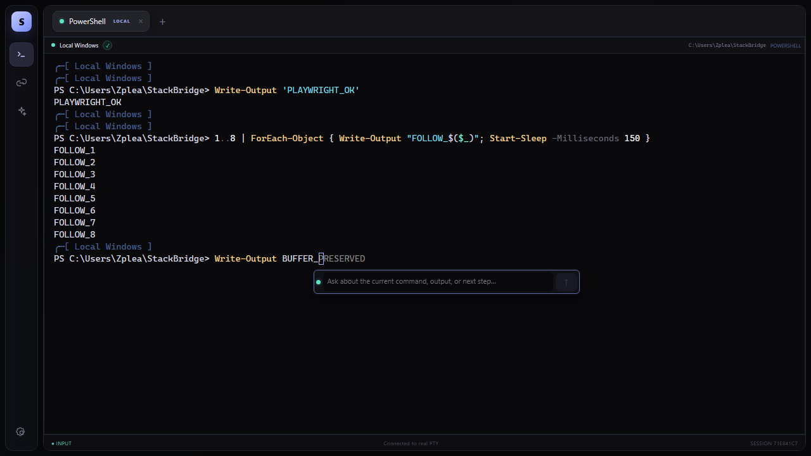
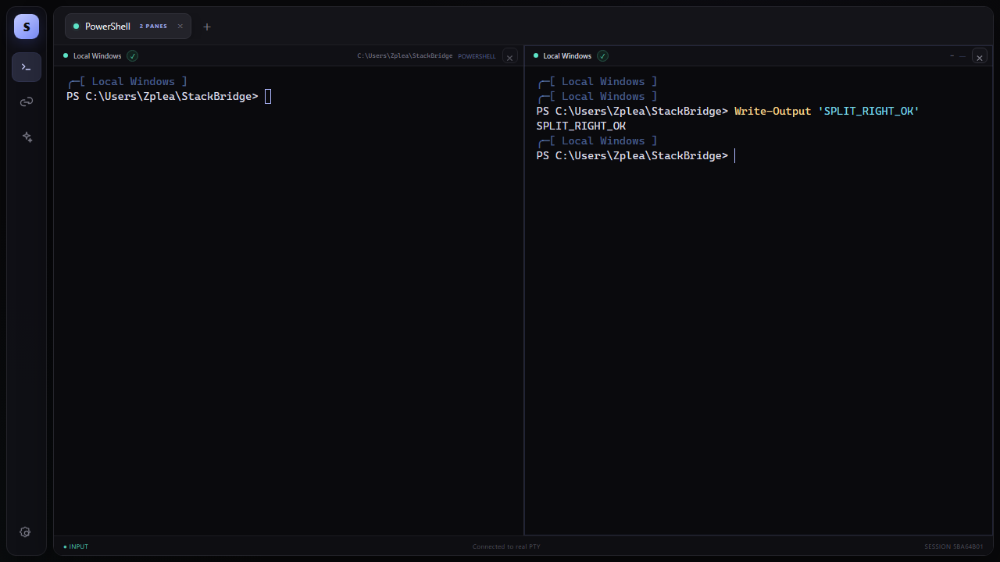
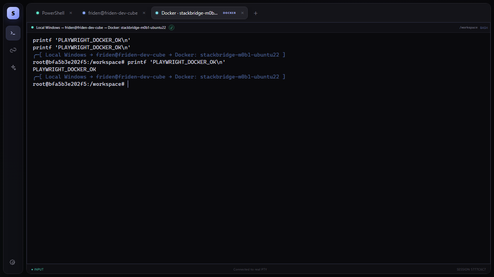

# StackBridge

**A local-first AI terminal workbench for Windows, SSH Linux hosts, and remote Docker containers.**

[English](README.md) | [简体中文](README.zh-CN.md)

[](https://github.com/SoloEdge-ai/StackBridge/actions/workflows/windows-release.yml)
[](https://github.com/SoloEdge-ai/StackBridge/releases/latest)

StackBridge brings local PowerShell, SSH sessions, and Docker shells into one terminal workspace. Its AI assistant receives bounded terminal context and can propose commands without silently taking control of the shell.

Every proposal is tied to the terminal and verified environment that produced it. A command runs only after explicit approval and only if the original shell is still idle, unchanged, and owned by the approving browser session.



> **Project status:** usable preview. The Windows x64 portable application, real PTYs, remote runtime verification, ChatGPT/DeepSeek conversations, and approval-gated command execution are implemented.

## Highlights

- **Real terminals:** local PowerShell through ConPTY, plus interactive SSH and remote Docker PTYs.
- **Verified targets:** host keys, runtime identity, Docker daemon identity, full container identity, start time, UID, cwd, shell, and mounts are checked before privileged actions.
- **Inline AI:** press `F8` to open Quick Ask beside the active xterm cursor without inserting AI trigger characters into the shell.
- **Provider-routed conversations:** choose ChatGPT through Codex sign-in or DeepSeek through an API key. Each conversation keeps its provider and model while each turn freezes its own execution scope.
- **Approval-gated execution:** suggestions are immutable, expire after five minutes, and execute at most once in the original shell.
- **Terminal workspace:** tabs, horizontal and vertical splits, output replay, refresh reattachment, and a single-writer lease.
- **Local-first credentials:** Codex authentication, system-encrypted DeepSeek credentials, and workspace data remain in the current Windows user profile.

## Screenshots

### Split terminals

Each pane owns an independent PTY, context, draft, and write lease.



### Verified remote environment

The active environment chain remains visible from local Windows through SSH to the selected Docker container.



## Download

Download the newest Windows x64 portable executable from the [latest GitHub Release](https://github.com/SoloEdge-ai/StackBridge/releases/latest).

Release assets use a versioned filename such as:

```text
StackBridge-Portable-0.1.2-x64.exe
```

Each release also includes `SHA256SUMS.txt`. The portable application is a single file and does not require Node.js or pnpm on the destination machine.

### Requirements

- Windows x64.
- For ChatGPT: Codex CLI `0.155.0` or newer available through `PATH`, plus a ChatGPT account for Codex sign-in.
- For DeepSeek: a DeepSeek API key. Codex is optional, so the app and terminals still start without it.

Verify Codex before launching StackBridge:

```powershell
codex --version
```

StackBridge validates every Codex candidate on `PATH`, resolves npm shims to their native executable, selects the newest compatible version, and checks `app-server` support. A missing or incompatible Codex installation disables ChatGPT only; terminals and DeepSeek remain available.

DeepSeek uses its Responses API directly. The desktop app encrypts the API key with Windows system protection before storing it; browser development mode keeps the key only for the current Core session. Models can return answers and command proposals, but cannot execute tools or bypass the existing approval chain.

> The current executable is not code-signed. Windows SmartScreen may display a warning on first launch.

## Quick start from source

Development requires Windows, Node.js 22.14 or newer, and pnpm 10.33 or newer.

```powershell
corepack enable
pnpm install --frozen-lockfile
pnpm dev
```

Open [http://127.0.0.1:5173](http://127.0.0.1:5173). The browser establishes a loopback-only, Origin-checked session automatically.

Build the portable application locally:

```powershell
pnpm desktop:portable
```

The output uses the version from `apps/desktop/package.json`, for example `release/StackBridge-Portable-0.1.0-x64.exe`.

## How it works

| Layer | Responsibility |
|---|---|
| `apps/desktop` | Electron window, Core lifecycle, desktop shortcut registration, and portable startup checks |
| `apps/web` | React, xterm.js, tabs, split layouts, Quick Ask, conversations, and approval UI |
| `apps/core` | HTTP/WebSocket boundary, PTYs, SSH/Docker sessions, ChatGPT/DeepSeek provider routing, approvals, and persistence |
| `packages/protocol` | Shared Zod schemas and TypeScript contracts |
| `runtime` | Linux amd64/arm64 runtime for identity verification, structured execution, Docker inspection, installation, and rollback |

The Electron renderer never launches shells directly. Core owns terminal processes, verified runtime bindings, proposal state, execution operations, and local persistence.

SSH uses the system OpenSSH client and existing `known_hosts`. Docker access runs through the verified SSH host, so containers do not need an SSH daemon or a resident StackBridge process.

## Safety model

StackBridge is built around four execution invariants:

1. A saved connection describes how to connect; it does not prove which runtime instance is currently connected.
2. Every AI turn freezes its terminal, environment frame, runtime binding, cwd, shell, context version, and input version.
3. Models and browser clients cannot select or override execution identity and approval authority.
4. An approved command runs only in the original idle shell while the approving session owns its write lease and the input line is empty.

Terminal output, prompts, OSC markers, container names, and UI focus are treated as context, not authorization evidence.

## Development

Run the main validation suite:

```powershell
pnpm typecheck
pnpm test
pnpm build
```

Go 1.24 is required when changing the Linux runtime:

```powershell
cd runtime
go test ./...
```

Pull requests to `main` build and retain a Windows artifact for 30 days. Every squash merge to `main` creates a version tag, a GitHub Release, the portable executable, and its SHA-256 checksum.

## Current limitations

- Browser refresh can reattach to live terminals, but Core restart does not preserve local PowerShell processes or remote PTYs.
- `tmux`, `screen`, elevated shells, password/MFA askpass, and unsupported shells fall back to reduced capabilities.
- Hand-typed SSH and Docker transitions can be tracked, but unverified environments cannot receive approved automatic command submission.
- Full-screen TUI, IME composition, sustained high-throughput workloads, and clean-Windows test matrices need broader validation.
- File auto-editing, native command tools, plugins, subagents, and unattended agent loops are not included in the current release.
- Windows packages are not yet code-signed and no standard installer or automatic updater is provided.

## Documentation

- [Product and engineering specification](docs/design/STACKBRIDGE_SPEC.md)
- [Codebase architecture](docs/design/CODEBASE_ARCHITECTURE.md)
- [Domain model and invariants](CONTEXT.md)
- [Protocol](docs/PROTOCOL.md)
- [Target identity protocol](docs/TARGET_PROTOCOL.md)
- [AI terminal verification](docs/AI-TERMINAL-VERIFICATION.md)
- [Windows portable verification](docs/WINDOWS-PORTABLE-VERIFICATION.md)
- [Current implementation status](docs/STATUS.md)

## Repository policy

`main` is protected. Changes require a pull request, the `Build and verify` check, and a squash merge. Force pushes, branch deletion, merge commits, and rebase merges are disabled.
